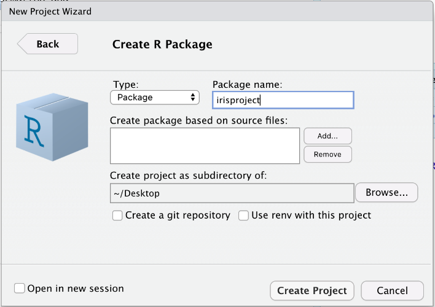
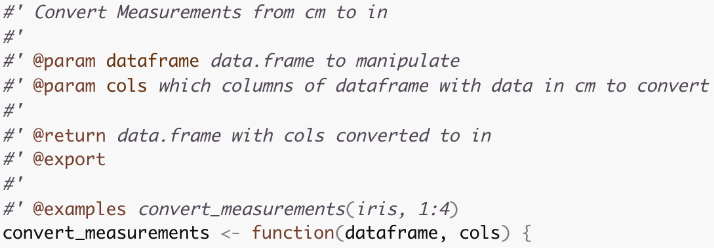
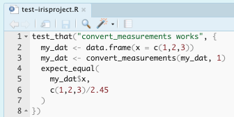
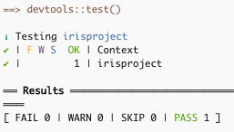
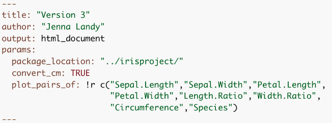
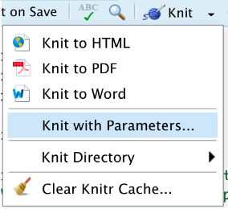
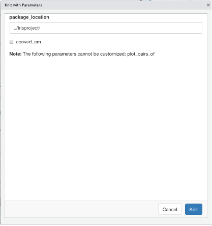

```{r setup, include=FALSE}
knitr::opts_chunk$set(echo = FALSE)
```

```{css, echo = FALSE}
.book {
  padding-top: 40px
}
```

Title: Remodel Your Rmd
Abstract: Through my experiences in industry and academia, I’ve learned that a lot of cool things can be done with R and RStudio. Even though they often intimidated me at first, they always ended up being intuitive, well documented, and very useful to my R workflow. In this presentation I’ll go through how I’ve “remodeled my Rmd”--and how you can do the same--by developing simple R packages for research projects, parameterizing R Markdowns for modular reports, making pretty R Markdowns, and publishing to R Markdown websites and Shiny Apps.


Topics Covered:

- R Package Development
- Parameterized Rmd Reports
- Rmd Customizations
- Interactive Plots
- Publishing R Markdown Websites with Github Pages

## Version 1: Your Basic Rmd

For demonstrations sake, we're going to start with `Version1.Rmd` and remodel it step by step. This very simple Rmd looks at the iris dataset, performs some data manipulation, and shows some plots.

Until very recently, every Rmd I made looked a little like Version 1. I would have some text, some code, and knit it using the default everything. The plots may look reasonably nice, and the code may work, but it's not the best Rmd it could be. The following tips and tricks will be especially useful if you need to use the functions defined in your Rmd in other files or on other people's computers, if you need to recompile your Rmd with different subsets of the data or with some additional pre-processing, if you need to share your results with collaborators who may or may not code, or if you'd like to publish your results publicly.

# R Package Development
**Why a package?**

1. Consolidating functions and constants used for a given research project
2. Roxygen to look up your functions documentation later (`?my_function`)
3. Unit testing
4. Easy interplay with version control (git/GitHub) for collaboration and sharing

We're going to start by focusing on the scenario where you need to use the functions defined in your Rmd in other files or on other people's computers. My old solution to this was to use one Rproject for every project I worked on, so I could source functions from Rscripts. This worked well, but then my research got bigger, and I wanted to have separate Rprojects for different aspects: testing my work on simulation studies, testing my work on real data, etc. Also, I found myself needing to use functions that I had written so long ago that I didn't know what file it was defined in and had to look deep into the code to remember what each parameter did. Some of this might've just been me having messy code, but no matter how clean your code is, consolidating it into an R package can make your life a little easier.

As a demonstration, I'll go through the steps to develop the very simple `irisproject` R package. This package will create functions for each of the data manipulation steps done in `Version1.Rmd`. This would be useful if the researcher wanted to be able to perform the same data manipulation steps in other Rmds or scripts, if they wanted to add unit tests for each function, if they wanted to collaborate on these functions over GitHub (though they might not necessarily want to share their Rmd), or if they wanted these functions to be publicly a avilable as an R package.

## Basic Steps

1. File > New Project
2. Select directory, then that you want to create an R package
3. Set package name > Create Project
```{r out.width = '40%', fig.align = 'center'}

```


4. Create an Rscript in the `R/` directory and add functions and/or constants
```{r out.width = '50%', fig.align = 'center'}
knitr::include_graphics("images/rpackage-2.png")
```

5. Build your package with `devtools::build()`, or navigate to the Build pane and More > Clean and Rebuild
```{r out.width = '40%', fig.align = 'center'}
knitr::include_graphics("images/rpackage-3.png")
```

Now your package is ready to use!

## Version 2: Using Your R Package

Now in `Version2.Rmd` we can load our `irispackage` and use the functions from the package for the data manipulation steps. The first time you use your package, you'll need to run `install.packages`, but after that is done once you'll run `update.packages` to make sure you load the latest version.

```{r eval = F, echo = T}
install.packages(
  "./irisproject/",
  repos=NULL,
  type="source"
)

library(irisproject)
```

## Improving Your R Package

1. **Roxygen documentation**  
   With your curser inside of a function, navigate to Code > Insert Roxygen Skeleton. This will give the outline for documentation that you can fill in with your function's description, parameter descriptions, what is returned, and examples. You can also choose to export the function (i.e. allow it to be accessed when someone loads the package) or not (i.e. keep private or helper functions hidden).  
```{r out.width = '60%', fig.align = 'center'}

```   
   Once the Roxygen skeletons are filled in, you can run `devtools::document()` to build the documentation `man/` files. Rebuild the package once more after this, and then you should be able to see the documentation with `?my_function`.  
```{r out.width = '40%', fig.align = 'center'}
knitr::include_graphics("images/rpackage-5.png")
```   
2. **Unit tests**  
  The unit tests are run using the `testthat` package. The tests are stored in the `tests/testthat` folder. New tests can be added to the existing test files, or a new file can be created manually or with `usethis::use_test('testname')`.  
```{r out.width = '40%', fig.align = 'center'}

```
  There are many of these `expect_` functions, including inequalities like `expect_gt()` (greater than), logic checks like `expect_true()`, and side-effect checks like `expect_error()`. A full list of these functions can be found in the [`testthat` Documentation](https://testthat.r-lib.org/reference/).  
  To run the unit tests, navigate to the Build pane, and click More > Test Package. The pane will update to show you the results of your tests.
```{r out.width = '40%', fig.align = 'center'}

```   
3. **Upload to GitHub**

## Tips

- If you update the package source code, rebuild it.
- If you have another R session open, you need to restart R and `update.packages` before you can use the most recent version of the package.
- If you use functions from other packages inside your package, it needs to be noted in the `NAMESPACE` and `DESCRIPTION` files. Rather than doing this manually:  
  - In the Roxygen documentation of your function that uses the package, add a line `@importFrom package function1 function2 ....`. This will update the NAMESPACE when documentation is updated.
  - Run `usethis::use_package('package')` in the console. This will update the DESCRIPTION file, which checks these dependencies upon package installation.

# Parameterized Rmd Reports
**Why parameterize?**

1. You can recompile your Rmd with different specifications without changing your code, for example:
    - Specify input file
    - Working with different subsets of data (specific time period, subset of groups, excluding outliers, etc.)  
    - Options for additional pre-processing
    - Options for what variables, models, plots, etc. to include
2. Non-coding collaborators can compile their own report with specifications using the user interface instead of looking at code

Now we're thinking about whether we may want to re-compile an Rmd with new data, new options, new reprocessing steps, etc. The obvious solution is to change your code and knit the Rmd again. But what if you want to go back to the old settings? What if you want a third set of settings? A forth? Changing the code can get tedious very quickly. Also, a collaborator who may not know how to code might want to re-knit your Rmd with an updated data file or their own specifications. This is a case for parameterized R markdown files!

## Adding Parameters

Parameters can be specified in the YAML header of an Rmd file. These can be standard R types, like strings and booleans, or R objects expressed with a `!r` prefix.

## Version 3: Parameterize Your Rmd

```{r out.width = '70%', fig.align = 'center'}

```  

Within the Rmd, when you want to access these parameters, you have to refer to them with a `params$` prefix, like this:
```{r eval = FALSE, echo = TRUE}
params$package_location
```

If you knit the file with the Knit button, the parameters specified in the YAML will be used. Alternatively, you can specify parameters with:

```{r eval = FALSE, echo = TRUE}
rmarkdown::render(
  "Version3.Rmd",
  params = list(
    package_location = "./irisproject",
    convert_cm = FALSE,
    plot_pairs_of = c("Sepal.Length","Species")
  )
)
```

You can also click Knit > Knit with Parameters, and a user interface will pop up to allow you to change the standard R type parameters in a way that doesn't require coding knowledge.

{width=40%} {width=40%}

# Rmd Customizations
**Why customize?**

2. share your results with collaborators who may or may not code

# Interactive Plots
**Why interactive?**

1. share your results with collaborators who may or may not code
2.  or if you'd like to publish your results publicly.

# Publishing with Github Pages
**Why publish?**

1. to publish your results publicly.
