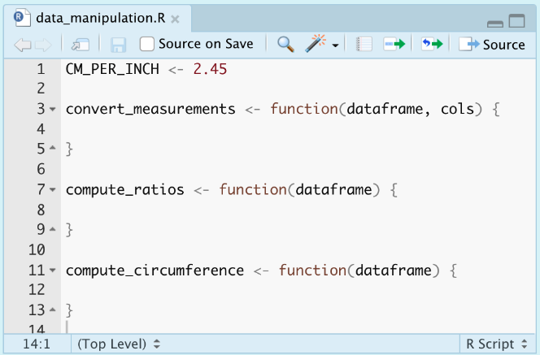

```{r setup, include=FALSE}
knitr::opts_chunk$set(echo = FALSE)
```

```{css, echo = FALSE}
.book {
  padding-top: 40px
}

.book .book-body .page-inner section.normal h1, .book .book-body .page-inner section.normal h2, .book .book-body .page-inner section.normal h3, .book .book-body .page-inner section.normal h4 {
  padding-top: 40px
}
```

```{r, echo = FALSE}
library(png)
library(grid)
library(gridExtra)
combine_pngs <- function(imgs, n = length(imgs), ncol = n, caption = NULL){
  imgs_rendered = list()
  for (i in 1:n) {
    imgs_rendered[[i]] <-  grid::rasterGrob(
      as.raster(readPNG(imgs[i])), 
      interpolate = FALSE
    )
  }
  rlang::exec(grid.arrange, !!!imgs_rendered, ncol = ncol, bottom = caption)
}
```

Through my experiences in industry and academia, I’ve learned that a lot of cool things can be done with R and RStudio. Even though they often intimidated me at first, they always ended up being intuitive, well documented, and very useful to my R workflow. In this tutorial I’ll go through how I’ve “remodeled my Rmd”--and how you can do the same--by developing simple R packages for research projects, parameterizing R Markdowns for modular reports, making pretty R Markdowns, and publishing to R Markdown websites and Shiny Apps.

Topics Covered:

- R Package Development
- Parameterized Rmd Reports
- Rmd Customizations
- Interactive Plots
- Publishing R Markdown Websites with Github Pages

## Version 1: Your Basic Rmd

For demonstrations sake, we're going to start with `Version1.Rmd` and remodel it step by step. This very simple Rmd looks at the iris dataset, performs some data manipulation, and shows some plots.

Until very recently, every Rmd I made looked a little like Version 1. I would have some text, some code, and knit it using the default everything. The plots may look reasonably nice, and the code may work, but it's not the best Rmd it could be. The following tips and tricks will be especially useful if you need to use the functions defined in your Rmd in other files or on other people's computers, if you need to recompile your Rmd with different subsets of the data or with some additional pre-processing, if you need to share your results with collaborators who may or may not code, or if you'd like to publish your results publicly.

# R Package Development
**Why a package?**

1. Consolidating functions and constants used for a given research project
2. Roxygen to look up your functions documentation later (`?my_function`)
3. Unit testing
4. Easy interplay with version control (git/GitHub) for collaboration and sharing

We're going to start by focusing on the scenario where you need to use the functions defined in your Rmd in other files or on other people's computers. My old solution to this was to use one Rproject for every project I worked on, so I could source functions from Rscripts. This worked well, but then my research got bigger, and I wanted to have separate Rprojects for different aspects: testing my work on simulation studies, testing my work on real data, etc. Also, I found myself needing to use functions that I had written so long ago that I didn't know what file it was defined in and had to look deep into the code to remember what each parameter did. Some of this might've just been me having messy code, but no matter how clean your code is, consolidating it into an R package can make your life a little easier.

As a demonstration, I'll go through the steps to develop the very simple `irisproject` R package. This package will create functions for each of the data manipulation steps done in `Version1.Rmd`. This would be useful if the researcher wanted to be able to perform the same data manipulation steps in other Rmds or scripts, if they wanted to add unit tests for each function, if they wanted to collaborate on these functions over GitHub (though they might not necessarily want to share their Rmd), or if they wanted these functions to be publicly a avilable as an R package.

## Basic Steps

1. File > New Project
2. Select directory, then that you want to create an R package
3. Set package name > Create Project
```{r out.width = '40%', fig.align = 'center'}
knitr::include_graphics("images/rpackage-1.png")
```


4. Create an Rscript in the `R/` directory and add functions and/or constants
```{r out.width = '50%', fig.align = 'center'}

```

5. Build your package with `devtools::build()`, or navigate to the Build pane and More > Clean and Rebuild
```{r out.width = '40%', fig.align = 'center'}
knitr::include_graphics("images/rpackage-3.png")
```

Now your package is ready to use!

## Version 2: Using Your R Package

Now in `Version2.Rmd` we can load our `irispackage` and use the functions from the package for the data manipulation steps. The first time you use your package, you'll need to run `install.packages`, but after that is done once you'll run `update.packages` to make sure you load the latest version.

```{r eval = F, echo = T}
install.packages(
  "./irisproject/",
  repos=NULL,
  type="source"
)

library(irisproject)
```

## Improving Your R Package

### Roxygen documentation 
   With your curser inside of a function, navigate to Code > Insert Roxygen Skeleton. This will give the outline for documentation that you can fill in with your function's description, parameter descriptions, what is returned, and examples. You can also choose to export the function (i.e. allow it to be accessed when someone loads the package) or not (i.e. keep private or helper functions hidden).  
```{r out.width = '60%', fig.align = 'center'}
knitr::include_graphics("images/rpackage-4.png")
```   
   Once the Roxygen skeletons are filled in, you can run `devtools::document()` to build the documentation `man/` files. Rebuild the package once more after this, and then you should be able to see the documentation with `?my_function`.  
```{r out.width = '30%', fig.align = 'center'}
knitr::include_graphics("images/rpackage-5.png")
```   
 
### Unit tests 
  The unit tests are run using the `testthat` package. The tests are stored in the `tests/testthat` folder. New tests can be added to the existing test files, or a new file can be created manually or with `usethis::use_test('testname')`.  
```{r out.width = '40%', fig.align = 'center'}
knitr::include_graphics("images/rpackage-6.png")
```
  There are many of these `expect_` functions, including inequalities like `expect_gt()` (greater than), logic checks like `expect_true()`, and side-effect checks like `expect_error()`. A full list of these functions can be found in the [`testthat` Documentation](https://testthat.r-lib.org/reference/).  
  To run the unit tests, navigate to the Build pane, and click More > Test Package. The pane will update to show you the results of your tests.
```{r out.width = '40%', fig.align = 'center'}

```   

### Upload to GitHub

## Tips

- If you update the package source code, rebuild it.
- If you have another R session open, you need to restart R and `update.packages` before you can use the most recent version of the package.
- If you use functions from other packages inside your package, it needs to be noted in the `NAMESPACE` and `DESCRIPTION` files. Rather than doing this manually:  
  - In the Roxygen documentation of your function that uses the package, add a line `@importFrom package function1 function2 ....`. This will update the NAMESPACE when documentation is updated.
  - Run `usethis::use_package('package')` in the console. This will update the DESCRIPTION file, which checks these dependencies upon package installation.

# Parameterized Rmd Reports
**Why parameterize?**

1. You can recompile your Rmd with different specifications without changing your code, for example:
    - Specify input file
    - Working with different subsets of data (specific time period, subset of groups, excluding outliers, etc.)  
    - Options for additional pre-processing
    - Options for what variables, models, plots, etc. to include
2. Non-coding collaborators can compile their own report with specifications using the user interface instead of looking at code

Now we're thinking about whether we may want to re-compile an Rmd with new data, new options, new reprocessing steps, etc. The obvious solution is to change your code and knit the Rmd again. But what if you want to go back to the old settings? What if you want a third set of settings? A forth? Changing the code can get tedious very quickly. Also, a collaborator who may not know how to code might want to re-knit your Rmd with an updated data file or their own specifications. This is a case for parameterized R markdown files!

Parameters can be specified in the YAML header of an Rmd file. These can be standard R types, like strings and booleans, or R objects expressed with a `!r` prefix.

## Version 3: Parameterize Your Rmd

In `Version3.Rmd`, you'll see  the first change on line 4 of the notebook: adding the `params` option to the YAML header. For the iris analysis example, we'll parameterized the location of the project's package, the option to convert inches to centimeters, and what variables to include in the pairs plot.

```{r out.width = '70%', fig.align = 'center'}
knitr::include_graphics("images/parameterized-1.png")
```  

Within the code, when we want to access these parameters, we refer to them as a value within the `params` list with the `params$` prefix:

```{r eval = FALSE, echo = TRUE}
params$package_location
```

If you knit the file with the Knit button, the parameters specified in the YAML will be used. Alternatively, you can specify parameters programmatically with:

```{r eval = FALSE, echo = TRUE}
rmarkdown::render(
  "Version3.Rmd",
  params = list(
    package_location = "./irisproject",
    convert_cm = FALSE,
    plot_pairs_of = c("Sepal.Length","Species")
  )
)
```

You can also click Knit > Knit with Parameters, and a user interface will pop up to allow you to change the standard R type parameters in a way that doesn't require coding knowledge:

```{r out.width = '30%', fig.align = 'center'}
knitr::include_graphics("images/parameterized-2.png")
```  


```{r out.width = '60%', fig.align = 'center'}
knitr::include_graphics("images/parameterized-3.png")
```  

## Improving Your Parameterization

### 1. Make user interface more intuitive for non-coding collaborators  
In the image above, we see that this user interface isn't as pretty as it could be. Further, we can't change the `plot_pairs_of` in the user interface because it is an R object. We can add additional specifications `label` and `value` in the YAML header that will make the user interface more intuitive. We can also change the `plot_pairs_of` variable to a string of comma-separated variable names, and deal with converting it to a list in the code later. This last step may not be necessary if you're parameterizing an Rmd for yourself, but it can be useful if someone who doesnt know R may be using it later.  
```{r out.width = '50%', fig.align = 'center'}
knitr::include_graphics("images/parameterized-4.png")
```  
```{r out.width = '60%', fig.align = 'center'}
knitr::include_graphics("images/parameterized-5.png")
```  

### 2. Using parameters in markdown  
  Parameters (or R code in general) can be incorporated into markdown in two different ways. 

1. First, inline R code can be used to have markdown text depend on parameters. Here are two examples, for which you would swap the single quotes for backticks
    a. 'r if(params\$convert_cm) {"- Convert measurements from centemeters to inches"}'
    b. The package location is 'r params\$package_location'
2. Second, you can utilize the function the `knitr::asis_output` function to produce markdown text from within a code chunk. For this, you'll want to make sure the results are displayed as is, and the code itself is not shown in the knitted version.
```{r out.width = '40%', fig.align = 'center'}

```  

# Rmd Customizations
**Why customize?**

1. Make your results as pretty as possible before sharing
2. Make your resulting HTML file easy to navigate

## Version 4: Customize Your Rmd

## Themes

The easiest way to make your Rmd pretty is to change its theme or format. There are lots of R packages that provide themes and formats, including [rmdformats](https://juba.github.io/rmdformats/), which provides the `robobook` format, and [prettydoc](https://prettydoc.statr.me/themes.html), which provides the `architect`, `cayman`, and `lenoids` themes, which are presented below.

```{r, echo = FALSE}
combine_pngs(
  c(
    'images/customize-1-architect.png',
    'images/customize-1-cayman.png',
    'images/customize-1-leonids.png',
    'images/customize-1-robobook.png'
  ),
  caption = 'Themes (left to right): architect, cayman, leonids, robobook'
)
```

To change the theme or format of your Rmd, simply update the output argument in the YAML header. For instance, to use a `prettydoc` theme, the header will look like this:
```
output:
  prettydoc::htmlpretty:
    theme: cayman
```
Alternatively, to use a `rmdformats` format, the header will look like this:
```
output:
  rmdformats::robobook
```

We use the `robobook` theme in `Version4.Rmd`. I like this one because it adds a simple sidebar table of contents.

## Tabs

Subsections can be change from vertically ordered sections to tabs that a user can toggle between. This is done by adding a CSS class attribute to the section header -- which is a lot easier than it sounds. Adding tabs is as simple as adding `{.tabset}` after your header.

```
# Section {.tabset}

## First Tab Name

first tab contents

## Second Tab Name

second tab contents
```

This markdown produces the following HTML:

```{r out.width = '70%', fig.align = 'center'}

```  

In `Version4.Rmd`, we put the data manipulation steps into separate tabs with descriptions of each step. We also use tabs to separate the two sections of "setup": loading packages and printing parameter inputs. For these tabs, we also add the `.tabset-fade` and `.tabset-pills` CSS classes for further customization

```{r out.width = '70%', fig.align = 'center'}
knitr::include_graphics("images/customize-3.png")
```  

## Kable Tables

Displaying your data or results in a visually pleasing way can make your Rmd look more professional and more interesting! `knitr`, the same package that lets you knit an Rmd and has functions to include images, exports the `kable` function that makes data tables look a lot nicer. It also allows for the option to round all numeric columns with the `digits` parameter.

In `Version4.Rmd`, we use `kable` to display pretty tables with values rounded to 3 decimal places.

```{r out.width = '50%', fig.align = 'center'}
knitr::include_graphics("images/customize-4.png")
``` 

## Interactive Plots Directly from `ggplot2`

Interactive plots are useful because some questions can be answered more quickly with interactive results, for example:

- Which observation is that outlier?
- Can we zoom in on the section with a lot of overlapping points?
- Can we look at only a particular range of x values?

There are a lot of packages that allow interactive plotting, including [plotly ](https://plotly.com/r/) and [leaflet](https://rstudio.github.io/leaflet/). They allow a lot of options for customization and create great plots, but it can take some time to learn their syntaxes. However, if you already have a `ggplot2` figure, you can very simply convert it to be interactive with the `ggplotly` function exported from the `plotly` package.

With this function, interactive plotting only adds one line of code on top of your existing `ggplot` call.

```{r, eval = FALSE, echo = TRUE}
library(ggplot2)
library(plotly)

p <- ggplot2::ggplot(...)
plotly::ggplotly(p)
```

In `Version4.Rmd`, we make the plot at the end interactive. Below I show a simplified version that just passes the `ggplot2` object to `ggplotly`.

```{r, echo = FALSE, message = FALSE}
update.packages(
  './irisproject',
  repos=NULL,
  type="source"
)

library(irisproject)
library(dplyr)
library(ggplot2)
library(plotly)

iris <- iris %>%
  convert_measurements(1:4) %>%
  compute_ratios() %>%
  compute_circumference()
```

```{r echo = TRUE}
p <- iris %>% ggplot(aes(
  x = Circumference, 
  y = Length.Ratio, 
  color = Species
)) +
  geom_point() +
  theme_classic() +
  theme(
    legend.position = 'top',
    legend.justification = 'left'
  )

plotly::ggplotly(p)
```

The more customized version shows code to add a custom tooltip with the `text` aesthetic in ggplot and the `tooltip` parameter in `ggplotly`. It also shows how to put the legend at the top of the plot instead of to the side, sinceplotly tends to cover up part of the legend.

```{r echo = TRUE}
p <- iris %>% ggplot(aes(
  x = Circumference, 
  y = Length.Ratio, 
  color = Species,
  text = paste0(
    "Species: ", Species,
    "\nCircumference: ", round(Circumference,3),
    "\nLength Ratio: ", round(Length.Ratio, 3),
    "\nWidth Ratio: ", round(Width.Ratio, 3),
    "\nPetal Width, Length: ", round(Petal.Width, 3),
        ", ", round(Petal.Length, 3),
    "\nSepal Width, Length: ", round(Sepal.Width, 3),
        ", ", round(Sepal.Length, 3)
  )
)) +
  geom_point() +
  theme_classic() +
  theme(
    legend.position = 'top',
    legend.justification = 'left'
  )

plotly::ggplotly(p, tooltip = c("text")) %>%
  plotly::layout(
    legend = list(
      orientation = "h",
      x = 0,
      yanchor = "bottom",
      y = 1.02
    )
  )
```


# Publishing with GitHub Pages
**Why publish?**

1. Make your work publicly accessible (such as this tutorial!)
2. Share a web address with collaborators instead of a large number of files. Access can be limited to those with read access to GitHub repository.

Making a website has always seemed intimidating to me, but finally I realized that with a few Rmds that output to HTMLs, I was already 90% of the way there. To flesh out your website, all that's needed is two new files: `_site.yml` and `index.html`.

The `_site.yml` document will hold the name of your website, the directory you want it to be built for, and then information for the navigation system. If you want to publish to a public GitHub pages website (instructions below), the `output_dir` *must* be `"docs"`, or GitHub won't look in the right place for your website files.

```{r out.width = '60%', fig.align = 'center'}
knitr::include_graphics("images/github_pages-3.png")
```  

The `index.Rmd` document will hold your home page. You can also rename an existing Rmd to `"index"` if you already have a homepage.

```{r out.width = '80%', fig.align = 'center'}
knitr::include_graphics("images/github_pages-4.png")
```  

To build your website, type the following into your console:

```{r eval = FALSE, echo = TRUE}
rmarkdown::render_site()
```

To publish on Github, first upload your full project directory to a GitHub repository. If you have GitHub pro, you can have a public webpage from a private GitHub repository, but otherwise, the repository must be public. Note that regardless of the visibility status of your repository, **the webpage WILL BE PUBLIC BY DEFAULT**. See GitHubs page on [changing the visibility of your site](https://docs.github.com/en/enterprise-cloud@latest/pages/getting-started-with-github-pages/changing-the-visibility-of-your-github-pages-site) if you need a private site.

Once your project is on GitHub, navigate to `Settings > Pages`. Select your git branch (usually `"master"`) to deploy from, select to build from the `"/docs"` folder, and click save. You should then see at the top that "your site is live at ...".

```{r out.width = '40%', fig.align = 'center'}
knitr::include_graphics("images/github_pages-1.png")
```  

The site will automatically update whenever you push changes to GitHub. Make sure you rebuild the site after every change to an Rmd!

